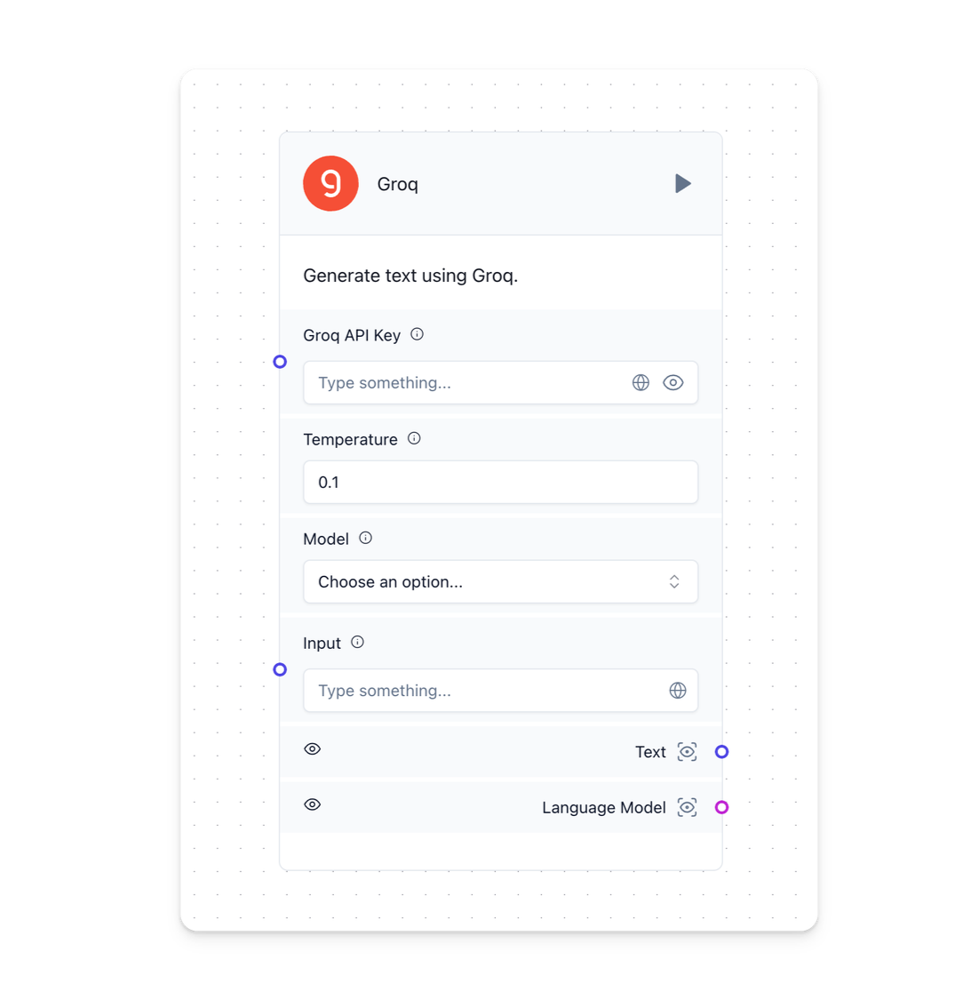
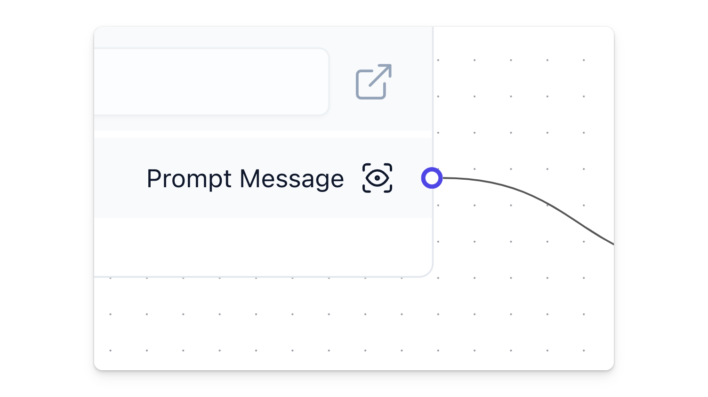

## Component {#0323a728d8314767adb907b998036bb4}

A component is a single building block within a flow. It consists of inputs, outputs, and parameters that define their functionality. These elements provide a convenient and  straightforward way to compose LLM-based applications. Learn more about components and how they work below.

During the flow creation process, you will notice handles (colored circles) attached to one or both sides of a component. These handles use distinct colors to indicate the types of inputs and outputs that can be interconnected. Hover over a handle to see connection details.

On the top right corner of the component, you'll find the a play button to run a component. Once it runs, a status icon appears and you can hover over that to visualize success or error messages. Start interacting with your AI by clicking the **Playground** at the bottom right of the workspace.

### Component Menu {#7e3f2f8ff5074b2fb3eee97c9cfaabe7}

Each component is unique, but they all have a menu bar at the top that looks something like this.

It consists of options such as:

- **Code** — displays the component's Python code. You can modify the code and save it.
- **Advanced** — See and adjust all parameters of a component.
- **Freeze** — After a component runs, lock its previous output state to prevent it from re-running.

Click **All** (the "..." button) to see all options.

### Output Preview {#ed7b3c34e0774b8a916b0e68821c9a7a}

Langflow includes an output visualizer for components that opens a pop-up screen. This allows you to easily inspect and monitor transmissions between components, providing instant feedback on your workflows.

### Advanced Settings {#b6430d4903df44f0ba4618a558c83d7b}

Langflow components can be edited by clicking the **Advanced Settings** button.

Hide parameters with the **Show** button to reduce complexity and keep the workspace clean and intuitive for experimentation.

You can also double-click a component's name and description to modify those. Component descriptions accept markdown syntax.

### Group Components {#c3f5ed818e3b40ceb6534dc358e1a5f2}

Multiple components can be grouped into a single component for reuse. This is useful when combining large flows into single components (like RAG with a vector database, for example) and saving space.

1. Hold **Shift** and drag to select components.
2. Select **Group**.
3. The components merge into a single component.
4. Double-click the name and description to change them.
5. Save your grouped component to in the sidebar for later use!

[group video here]

### Component Version {#887fd587589448dc8c27336d1c235b9b}

A component's state is stored in a database, while sidebar components are like starter templates. As soon as you drag a component from the sidebar to the workspace, the two components are no longer in parity.

The component will keep the version number it was initialized to the workspace with. Click the **Update Component** icon (exclamation mark) to bring the component up to the `latest` version. This will change the code of the component in place so you can validate that the component was updated by checking its Python code before and after updating it.

