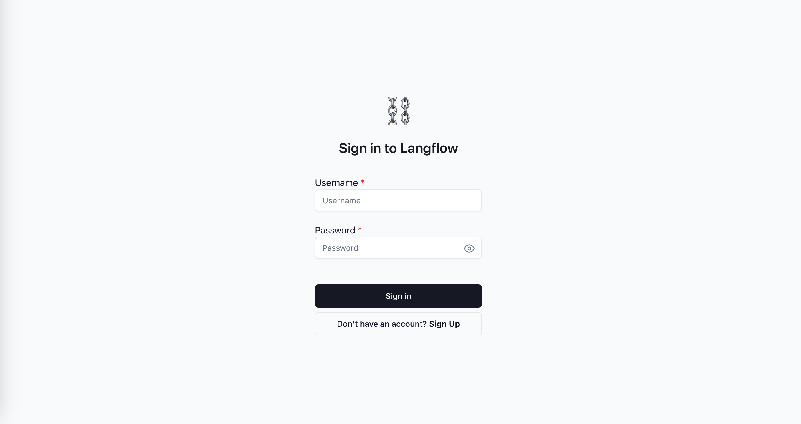

# Deploy Langflow on AWS

**Duraration**: 30 minutes

## Introduction
In this tutorial, you will learn how to deploy langflow on AWS using AWS Cloud Development Kit (CDK).
This tutorial assumes you have an AWS account and basic knowledge of AWS.

The architecture of the application to be created:


[Application Load Balancer](https://aws.amazon.com/elasticloadbalancing/application-load-balancer/?nc1=h_ls), [AWS Fargate](https://aws.amazon.com/fargate/?nc2=type_a) and [Amazon Aurora](https://aws.amazon.com/rds/aurora/?nc2=type_a) are created by [AWS CDK](https://aws.amazon.com/cdk/?nc2=type_a).
The aurora's secrets are managed by [AWS Secrets Manager](https://aws.amazon.com/secrets-manager/?nc2=type_a).
The Fargate task is divided into a frontend and a backend, which communicate through service discovery.
If you just want to deploy resources, you do not need in-depth knowledge of each of the above services.

# How to set up your environment and deploy langflow
1. Open [AWS CloudShell](https://us-east-1.console.aws.amazon.com/cloudshell/home?region=us-east-1).
1. Run the following commands in Cloudshell:
    ```shell
    git clone https://github.com/aws-samples/cloud9-setup-for-prototyping
    cd cloud9-setup-for-prototyping
    ./bin/bootstrap
    ```
1. When you see `Done!` in Cloudshell, open `cloud9-for-prototyping` from [AWS Cloud9](https://us-east-1.console.aws.amazon.com/cloud9control/home?region=us-east-1#/).
    
1. Run the following command in the Cloud9 terminal.
    ```shell
    git clone -b aws-cdk-dev2 https://github.com/kazuki306/langflow
    cd langflow/scripts/aws
    cp .env.example .env # Edit this file if you need environment settings
    npm ci
    cdk bootstrap
    cdk deploy
    ```
1. Access the URL displayed.
    ```shell
    Outputs:
    LangflowAppStack.NetworkURLXXXXXX = http://alb-XXXXXXXXXXX.elb.amazonaws.com
    ```
1. Enter your user name and password to sign in. If you have not set a user name and password in your `.env` file, the user name will be set to `admin` and the password to `123456`.
    

# Cleanup
1. Run the following command in the Cloud9 terminal.
    ```shell
    bash delete-resources.sh
    ```
1. Open [AWS CloudFormation](https://us-east-1.console.aws.amazon.com/cloudformation/home?region=us-east-1#/getting-started), select `aws-cloud9-cloud9-for-prototyping-XXXX` and delete it.
